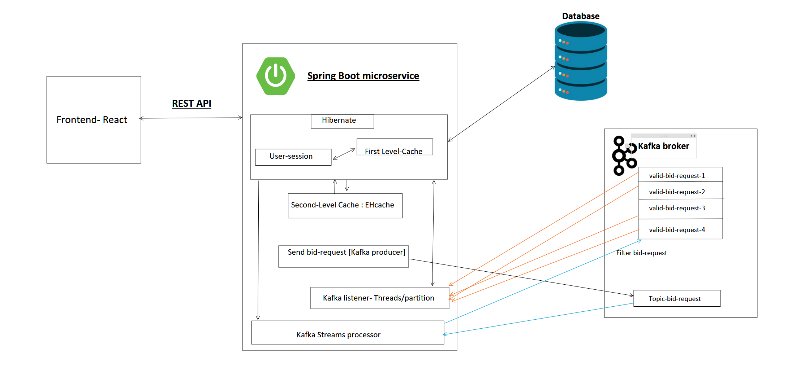

# Real-time-auction
Welcome to our Real-Time Auction Web App, a dynamic platform that brings auctions to life with real-time updates and seamless user experience. Built on a robust microservices architecture using Kafka and Spring Boot, coupled with cache integration for optimized performance, our application ensures smooth and scalable auctioning experiences.

- [Motivation](#motivation)
- [Features](#Features)
- [Building and running](#building-and-running-the-project)
- [Architecture](#architecture)

# [Video demo] (https://www.youtube.com/watch?v=CfGrs4omHFg)

#  Motivation
   Conventional auction systems face limitations in real-time functionality and encounter scalability and performance issues, particularly during peak traffic. To solve this, our objective is to create a real-time auction application utilizing Kafka, Spring Boot microservices. 

# Features
-  Seamlessly register, create auctions, and place bids on multiple auctions simultaneously using our intuitive REST API.
-  Kafka topics for real-time bid processing, ensuring efficient handling and synchronization of bids across the platform.
-  Experience real-time bid updates from specific auctions through Server-Sent Events (SSE) from the backend, keeping users informed of the latest bidding activity.
-  Enhance performance by implementing database record caching, reducing I/O operations to the database and improving overall responsiveness.
-  Our backend is fully dockerized, making deployment a breeze and providing scalability and portability across different environments.

# Building and Running the project
Getting started with this project is a breeze, thanks to its Docker-based setup. Follow these simple steps to kick off this app:

1. **Install Docker:**
   Ensure Docker is installed on your system. You can download and install Docker from the [official website](https://www.docker.com/get-started).

2. **Build Docker Images:**
   Execute the provided bash script to build the Docker images for frontend & backend app. If you're on a Linux machine or using Windows Subsystem for Linux (WSL), simply run the script to initiate the process.
```./build_docker_images.sh```

3. ***Start the containers***   
    ```docker-compose up```
    Ensure Docker is running in the background. This command will download the required images for services such as Zookeeper, Kafka, and MySQL. The Spring app may take a few attempts to start as the database and Kafka services need time to initialize. After a few retries, you'll see log messages indicating the backend Spring app is running successfully.

    `Note: The backend app image isn't compatible with Mac ARM architecture. For testing, please use Windows/Linux with x86 architecture Docker setups.`

4.  ***Access the backend***

    By default, the Spring backend runs on `localhost:8080` You can test the backend functionality by accessing this URL in your web browser or using API testing tools.
    
    REST API is documented here - [REST API](/backend/restAPI.md)

5. Running the frontend:
   ```
   cd frontend
   npm i
   npm start
   ```
   The web app is on http://localhost:3000/

   Please make sure you clear all your cookie before lanching, the web app will check for your cookie with the "auction-userID" key to check to see if you are logged in or not to proceed. Thanks!
# Architecture
   
